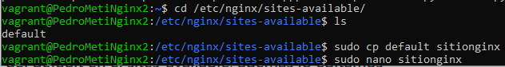

# CMS-3capas

En este proyecto realizaremos una configuración con una máquina que funcionará como balanceador, 2 que funcionarán con Nginx, otra que tendra el PHP y nfs y una ultima que tendra MySQL Server.

## Configuración VagrantFile y scripts de aprovisionamiento.

También hay que configurar los scripts que aprovisionarán las máquinas para que de esta forma, la primera vez que las iniciemos se instalen los paquetes necesarios de cada una.

### Script máquina MySQL

### Script máquinas Nginx

### Script máquina Balanceador

### Configuración máquina NFS.

## Máquina MySQL

Empezaremos configurando esta máquina. Para ello, lo primero que haremos será acceder al directorio _/etc/mysql/mariadb.conf.d_ y una vez dentro, modificaremos el fichero _50-server.cnf_ con el siguiente comando.

    cd /etc/mysql/mariadb.conf.d

    sudo nano 50-server.conf

Una vez dentro del fichero, habrá que cambiar la línea **bind-address** y aquí pondremos la IP de nuestra máquina MySQL.

Después de esto, tendremos que asignar una contraseña al root de MySQL para poder acceder con el posteriormente. Esto lo haremos con el comando:

    sudo mysql_secure_installation
Respondiendo lo siguiente:

Ahora entraremos a MySQL como usuario root y crearemos un usuario normal con la IP de la máquina Nginx (al haber más de una máquina, pondremos un % para que haga referencia a todas). A este usuario le daremos todos los permisos dentro de la base de datos que posteriormente agregaremos.

    create user 'lamp_user'@'%' identified by 'lamp_password';
    grant all privileges on lamp_db.* to 'lamp_user'@'%';
    flush privileges;

En el home de esta maquina clonaremos el repositorio de git que usaremos para descargar nuestra base de datos.

    sudo git clone https://github.com/josejuansanchez/iaw-practica-lamp.git

Una vez hecho esto, importaremos la base de datos a nuestro MySQL usando el fichero _database.sql_. Para ello usaremos el siguiente comando:

    sudo mysql -u root -p < database.sql

Con esto habríamos terminado la configuración de esta máquina por lo que podremos borrar la carpeta _iaw-practica-lamp_.

## Configuración máquina NFS.
Primero hacemos un update y despues instalamos el kernel-server.

    sudo apt-get update
    sudo apt-get install nfs-kernel-server

Ahora creamos la carpeta que vamos a compartir y la cambiamos el usuario y grupo.

    sudo mkdir /var/nfs/general -p
    sudo chown nobody:nogroup /var/nfs/general
    ls -la /var/nfs/general

Por ultimo editaremos el _exports_ y le añadiremos las IPs de nuestros NGINXS.

    sudo nano /etc/exports

Añadimos lo siguiente en el archivo:

    /var/nfs/general    IP-NGINX1(rw,sync,no_subtree_check)
    /var/nfs/general    IP-NGINX2(rw,sync,no_subtree_check)

Y antes de acabar reiniciamos el _kernel-server_

    sudo systemctl restart nfs-kernel-server

## Configuración ambas máquinas Nginx.

Primero vamos a acabar el NFS-client

    sudo apt-get update
    sudo apt-get install nfs-common

Lo siguiente es crear el directorio compartido y montarlo/vincularlo

    sudo mkdir -p /nfs/general
    sudo mount 192.168.5.4:/var/nfs/general /nfs/general
    df -h

Comprobamos que funciona:

Este proceso lo realizaremos en ambas máquinas ya que tendrán la misma configuración.Para empezar, tendremos que ir a _/var/www_, crear una carpeta con el nombre que queramos y cambiarle el dueño y grupo. Una vez hecho entramos a ella y clonamos el repositorio de git **https://github.com/josejuansanchez/iaw-practica-lamp.git**.

    sudo mkdir /var/www/sitiopedro
    sudo chown www-data.www-data /var/www/sitiopedro
    ls -la /var/www/sitiopedro

    cd /var/www/sitiopedro
    sudo git clone https://github.com/josejuansanchez/iaw-practica-lamp.git

Al clonar el repositorio se nos crea una carpeta, entraremos a ella y moveremos a la carpeta _sitiopedro_ todo el contenido de la carpeta _src_. 

    cd /var/www/sitiopedro/iaw-practica-lamp/src
    sudo mv * /var/www/sitiopedro
    cd ..
    sudo rm -r iaw-practica-lamp

Lo siguiente, sería definir la IP de MySQL. Esto lo haremos en el fichero _config.php_ cambiando el valor de **DB_HOST**.

    sudo nano config.php

Ahora vamos a la ruta _/etc/php/7.4/fpm/pool.d_ y configuramos el fichero _www.conf_ para poder conectarnos por **socket TCP/IP**.

Aquí bajaremos hasta la línea que empieza por la palabra listen y borraremos lo que esta escrito para poner la IP 127.0.0.1 con el puerto 9000.Ahora reiniciamos el servicio con sudo systemctl restart php7.4-fpm.

Duplicaremos el fichero _default_ y en el nuevo pondremos en root la ruta de la carpeta _sitiopedro_ y añadiremos **index.php** al lado de **index.html** para que pueda detectar el servicio PHP. Más abajo, desdocumentaremos las líneas de los location dejando la de **fastcgi_pass unix** documentada ya que esta solo se usa cuando quieres emplear una conexión mediante un socket unix.

Una vez configurado, haremos un enlace de este archivo hacia _sites-enabled_ y borraremos el que había de default.

    sudo rm default
    sudo ln -s /etc/nginx/sites-available/sitionginx /etc/nginx/sites-enabled/

Ahora con **sudo nginx -t** comprobamos que la configuración del servicio nginx se haya realizado correctamente y para finalizar reiniciamos el servicio.

    sudo nginx -t
    sudo systemctl restart nginx

## Configuración máquina Balanceador.

Primero vamos a _/etc/nginx/sites-enabled_ y borramos el archivo default.

    cd /etc/nginx/sites-enabled

Ahora crearemos un fichero en _/etc/nginx/conf.d_ y le agregaremos las siguientes líneas.

    sudo nano /etc/nginx/conf.d/confbalanceador.conf

Dentro del archivo introducimos la siguiente información.

    upstream balanceador {
        server 192.168.5.2;
        server 192.168.5.3;
    }

    server {
        listen 80;
        server_name balanceador.com;

        location / {
            proxy_pass http://balanceador;
        }
    }

Con esto ya quedaría configurado nuestro balanceador.